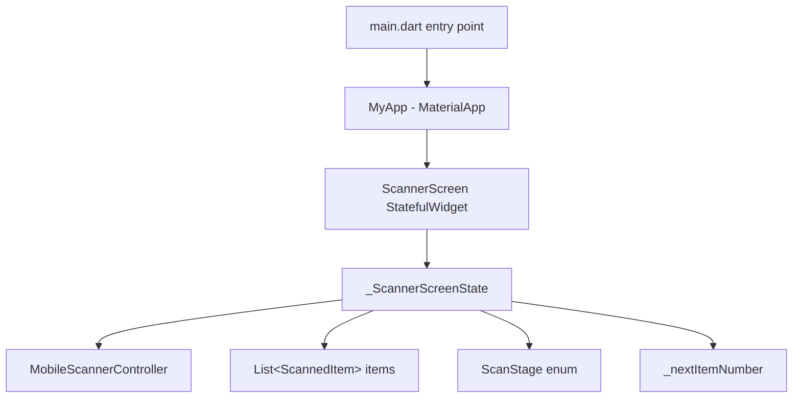
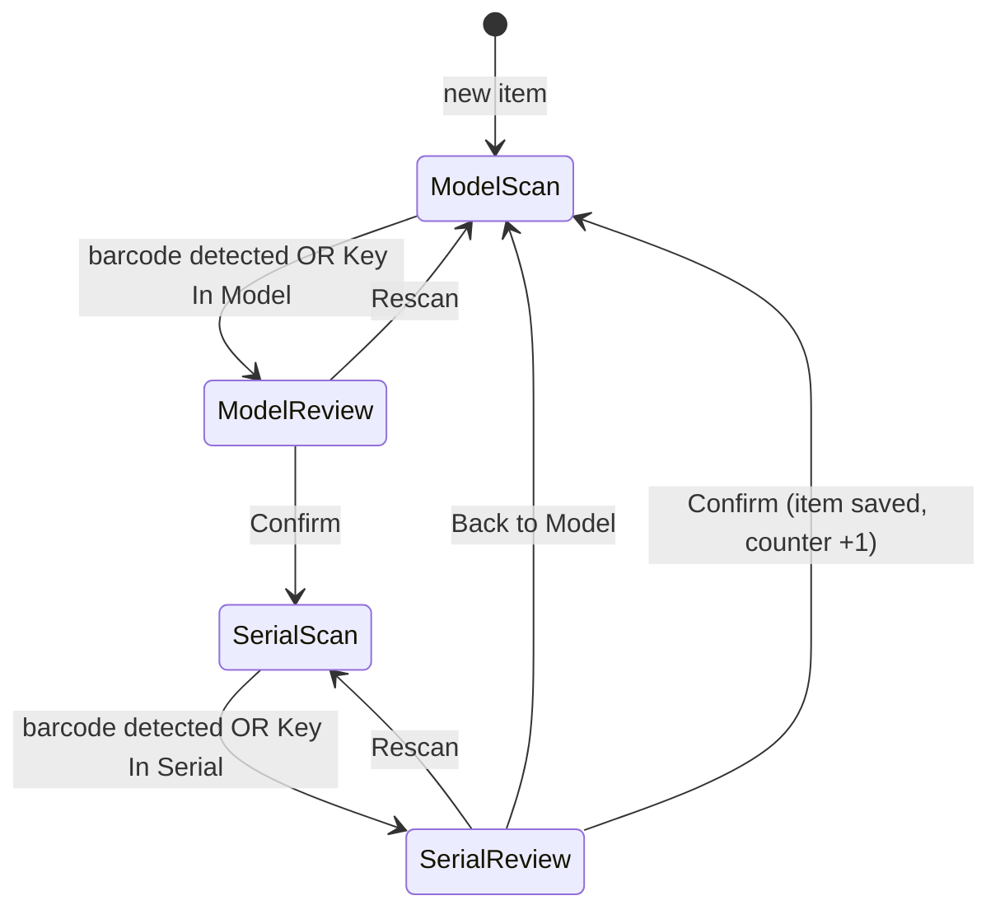
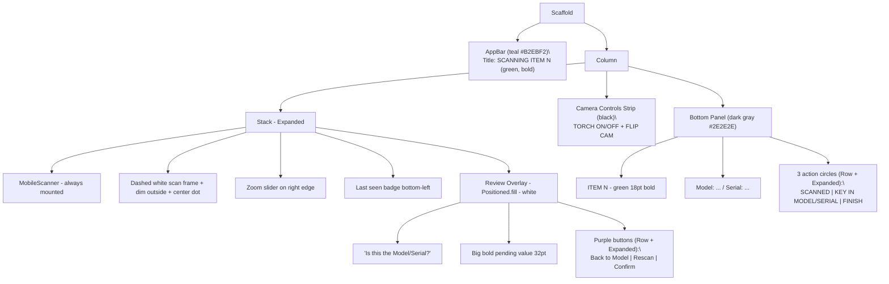
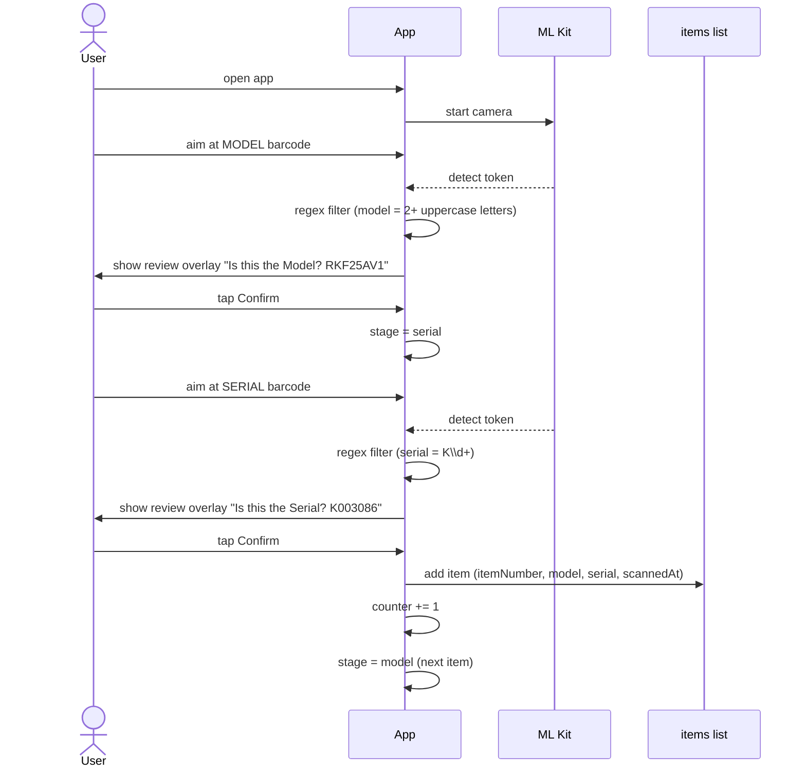

# Daikin Barcode Scanner — Project Flow

A Flutter Android app that scans Daikin equipment labels (model + serial), accumulates multiple items, and exports the result as CSV.

- **Tech**: Flutter (Dart) + `mobile_scanner` (Google ML Kit under the hood)
- **Target**: Android (tested on Tecno POVA 5 Pro 5G, Android 14)
- **Repo**: https://github.com/Ai-mali/barcode_scanner

---

## 1. App architecture



---

## 2. Per-item state machine

Each item goes through 4 stages: scan model → review model → scan serial → review serial → save.



Camera **never stops** during state transitions — review screens are rendered as an overlay on top of the live camera (Stack-based architecture). This avoids the Android preview-surface freeze bug.

---

## 3. Screen layout



---

## 4. User flow — scan one item



---

## 5. Data model

```dart
class ScannedItem {
  final int itemNumber;     // permanent, never renumbers on delete
  final String model;
  final String serial;
  final DateTime scannedAt;
}

enum ScanStage { model, modelReview, serial, serialReview }
```

---

## 6. Key features

| Feature | Behavior |
|---|---|
| **Multi-item** | Scan many items in sequence; SCANNED badge shows count |
| **Permanent numbering** | Deleting item 4 leaves a gap; next scan uses N+1, never reuses |
| **Auto-detect Model vs Serial** | Regex: model = `^[A-Z]{2,}[A-Z0-9]+$`, serial = `K\\d+` |
| **QR over 1D** | If both QR and Code128 visible, QR token wins |
| **Tracking ignore** | Skips tokens like `123-45` (work-order tracking codes) |
| **Manual KEY IN** | Pops a dialog. Model dialog shows recent-models chips (A-Z, vertical wrap, scroll) |
| **Zoom** | Vertical slider 0–100% with amber badge |
| **Torch** | Toggle button in camera-controls strip |
| **Flip camera** | Front/rear toggle in camera-controls strip |
| **Rescan** | Clears pending value, returns to scanning stage; camera stays live |
| **Back to Model** | On serial review, lets user re-scan the model for the current item |
| **Scanned dialog** | Centered title `SCANNED ITEM (N)` + date, list of `N: MODEL / SERIAL` rows with delete |
| **FINISH** | Shows CSV preview; copy to clipboard or clear all |

---

## 7. File structure

```
barcode_scanner/
├── lib/
│   └── main.dart              # entire app — single-file
├── android/                   # Android platform code (untouched)
├── ios/                       # iOS scaffolding (not used yet)
├── pubspec.yaml               # dependencies (mobile_scanner, flutter sdk)
├── PROJECT_FLOW.md            # this file
└── README.md
```

---

## 8. Changelog

> Append a new entry every time you push. Newest at the top.

### 2026-05-02

- KEY IN MODEL chips: vertical wrap, scrollable when overflowing, A-Z sort
- Permanent item numbers: deleting item N leaves a gap; counter only goes up
- Scanned dialog redesigned: centered `SCANNED ITEM (N)` title + date, `N: MODEL / SERIAL` rows
- Scan frame: dashed white border, centered, dim overlay outside, small center dot
- KEY IN MODEL: autocomplete chips suggesting previously-entered models

### 2026-05-01

- Bottom 3 action buttons share screen width via `Expanded`
- Purple review buttons fit on one row via `Row + Expanded`
- AppBar title bigger (20pt) and green (`kGreen`)
- Yellow scan rectangle (later replaced) moved to 10px below AppBar
- Camera controls strip: TORCH + FLIP CAM with labels in black strip below camera
- Bottom action buttons enlarged (76px circles, 34px icons, 13pt labels)

### 2026-04-30 — Multi-item UI overhaul

- Teal AppBar `#B2EBF2` with `SCANNING ITEM N` header
- Dark bottom panel `#2E2E2E` with green `ITEM N`, model/serial row
- Action buttons: SCANNED (with badge), KEY IN, FINISH (red)
- Stack-based architecture: camera always mounted, review as `Positioned.fill` overlay (fixes Rescan freeze)
- Multi-item accumulation with `List<ScannedItem>` + `_nextItemNumber`
- CSV export via `Clipboard.setData`
- Two-stage workflow per item (model → serial → next)

### Earlier

- Initial Flutter project scaffold + barcode scanner working on Tecno POVA 5 Pro 5G
- Regex-based filtering of valid model/serial tokens
- Zoom slider, torch toggle
- QR prioritized over 1D Code128